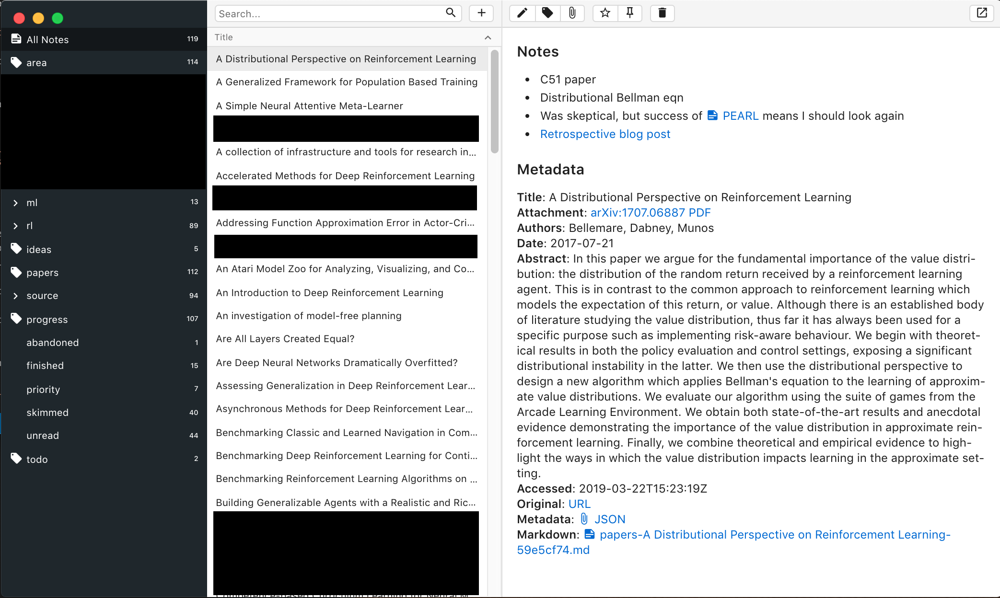

**This is not yet ready for primetime. Don't use this unless you're up for janitoring your own paper library.**

This is a local webserver which makes it easy to add research papers to [Notable](https://github.com/notable/notable). This turns Notable into a paper library where note-taking is front and center.

<p align="center"> 
    
</p>

The motivation is that Zotero and Mendeley (the two paper libraries I've used previously) center on a giant table of paper titles/authors/publication dates/etc, when really the important parts are my notes, my tags, and search. Notable has a great tagging system, great Markdown notes, and fast search over both. Combined with Zotero's [huge list of reference importers](https://github.com/zotero/translators), it makes a handy tool for the industrial researcher.

### Usage
Install and run it with

```bash
git clone git@github.com:andyljones/zonotable.git
npm install
npm start
```
then add the following as a bookmark:
```
javascript:(function()%7B(function%20()%20%7Bxhr%20%3D%20new%20XMLHttpRequest()%3Bxhr.open('POST'%2C%20encodeURI('http%3A%2F%2F127.0.0.1%3A1969%2Fnotable'))%3Bxhr.send(document.location.href)%3B%7D())%7D)()
```
Visit any paper repository [supported by Zotero](https://github.com/zotero/translators) and click the bookmark to add it's metadata as a new note in Notable.

### Notes
Most of the code in this repo comes from Zotero, and in particular [it's translation server](https://github.com/zotero/translation-server). The translation server is pretty heavy weight however (>100MB repo), so this repo is cut down to the minimum needed.

One limitation right now is that it can't extract metadata directly from pdfs. Rather you need to be viewing the landing page, like arXiv's [/abs](https://arxiv.org/abs/1707.06347) page. This is because Zotero extracts pdf metadata using a [recognizer server](https://github.com/zotero/recognizer-server) that's substantially harder to get running independently than the translation server.

At some point - when I've finished dogfooding - this'll be turned into an npm package. And at some further point in the future, hopefully it'll be a [Notable plugin](https://github.com/notable/notable/issues/128).

It's worth noting that I am not a very good JavaScript developer.

### TODO
* Add more fields to the Markdown
* Turn this into an npm package
* Raise an error through the browser if something goes wrong (and a message if it goes right?)
* Find and catch the errors that manifest as `UnhandledPromiseRejectionWarning: Error: ESOCKETTIMEDOUT`. Manifests as a slightly misformatted Notable entry.
* Make the tests actually test something
* Add a script for importing an existing Zotero library
* Download PDF attachments and store them locally
* Index downloaded PDFs in a way that Notable can search? Uh, is this sensible?
* Add mechanism for opening newly added papers in Notable. Needs a Notable API.
* Figure out what's going on with CSR blocking requests on OpenReview. The Zotero extension works there, why doesn't the bookmark?
    * Problem is the `Content-Security-Policy: connect-src 'self' export.arxiv.org` header that OpenReview serves. Zotero runs a 'background page' view where requests are done from, and that seems to bypass it.
    * Turns out CSP has [killed bookmarklets in general](https://geordgez.github.io/jots/2017/12/31/xss-csp-bookmarklet). Welp. Need to develop an extension I guess. 